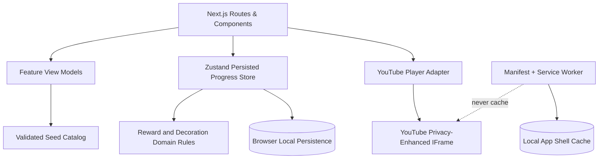
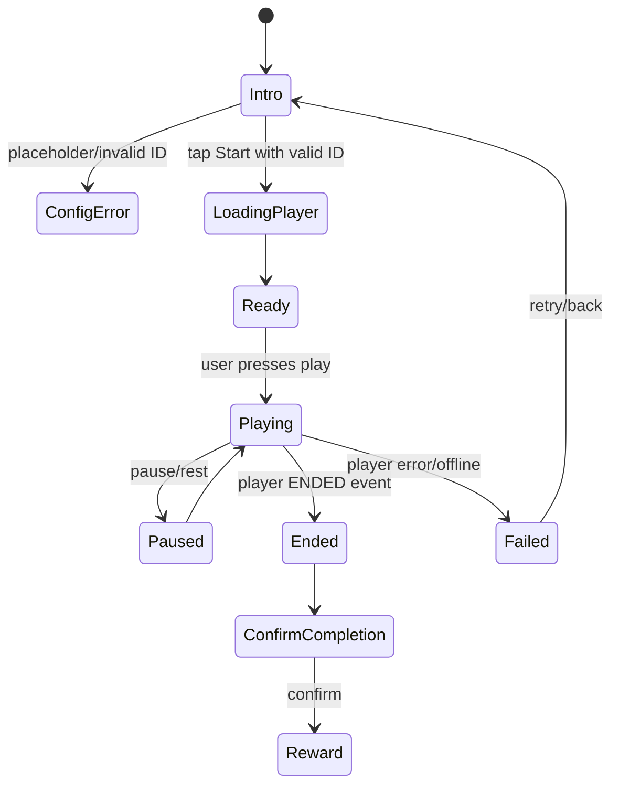

# Technical Design — Nhà Nhỏ Vận Động MVP

## 1. Design goals

- Tạo trải nghiệm PWA mobile-first chạy tốt trên Vercel.
- Hoàn thành vòng lặp chơi đầu tiên mà không cần backend.
- Tách rõ content seed, state/progress, player integration và UI.
- Đảm bảo phần thưởng idempotent và player lỗi không cấp thưởng.
- Giữ dữ liệu của bé trên thiết bị trong MVP.

## 2. Technology decisions

| Area | Decision | Rationale |
|---|---|---|
| Framework | Next.js App Router + TypeScript | PWA/Vercel friendly, route cấu trúc rõ |
| State | Zustand persist | Progress nhỏ, thao tác client-side, dễ reset |
| Validation | Zod | Validate seed và state sau hydrate |
| Content | Static TypeScript modules | Không cần backend/CMS ở MVP |
| Animation | Motion | Reward reveal và item placement nhẹ |
| Player | YouTube IFrame Player API, privacy-enhanced host | Nhận event kết thúc; load theo thao tác |
| PWA | Manifest + custom minimal service worker | Đủ install/offline shell, ít magic |
| Testing | Vitest/RTL + Playwright | Kiểm tra rule và end-to-end flow |

## 3. High-level architecture



## 4. Route design

| Route | Component responsibilities | Client state interaction |
|---|---|---|
| `/` | Show room preview, selected character, progress, next mission CTA | Read progress store |
| `/onboarding` | Character cards, optional nickname | Initialize/select character |
| `/mission/[missionId]` | Mission intro; lazy player after start; pause/stop/error states | Read mission; write no reward until completion |
| `/reward/[missionId]` | Reveal item/stars; already-earned fallback | Read completion result |
| `/room` | Render room and fixed slot selector | Equip/replace room item |
| `/wardrobe` | Render accessory selection | Equip/remove accessory |
| `/parent` | Display progress/safety/reset | Reset with explicit confirmation |

## 5. Data model

```ts
export type CharacterId = 'rabbit-cloud' | 'bear-honey' | 'cat-star';
export type Difficulty = 'easy' | 'medium';
export type RoomSlotId =
  | 'floor-rug'
  | 'bed'
  | 'window'
  | 'wall-art'
  | 'lamp'
  | 'plant'
  | 'toy';
export type ItemType = 'room-decoration' | 'character-accessory';

export interface Character {
  id: CharacterId;
  name: string;
  description: string;
  avatarSrc: string;
  roomBackgroundSrc: string;
}

export interface Mission {
  id: string;
  dayNumber: number;
  title: string;
  kidTitle: string;
  story: string;
  youtubeVideoId: string;
  durationMinutes: number;
  difficulty: Difficulty;
  rewardStars: number;
  rewardItemId: string;
  parentSafetyNote: string;
  isActive: boolean;
}

export interface Item {
  id: string;
  name: string;
  type: ItemType;
  imageSrc: string;
  roomSlotId?: RoomSlotId;
  compatibleCharacterIds?: CharacterId[];
  unlockSource: 'mission' | 'stars';
  unlockMissionId?: string;
  requiredStars?: number;
}

export interface WorkoutCompletion {
  missionId: string;
  completedAt: string;
  videoEnded: boolean;
}

export interface ChildProgressState {
  version: number;
  childNickname?: string;
  selectedCharacterId?: CharacterId;
  totalStars: number;
  completedMissions: WorkoutCompletion[];
  unlockedItemIds: string[];
  equippedAccessoryItemIds: string[];
  roomLayout: Partial<Record<RoomSlotId, string>>;
}
```

## 6. Seed data modules

```text
src/data/
├─ characters.ts   # exactly 3 starter characters
├─ missions.ts     # exactly 7 MVP missions; replaceable YouTube IDs
└─ items.ts        # room decorations and accessories
```

Rules:
- Validate all arrays with Zod before they enter page/view-model logic.
- Mission `rewardItemId` must reference an item in `items.ts`.
- Item mission unlocks must reference a mission where applicable.
- Placeholder YouTube IDs must be detectable by `isConfiguredVideoId()`.

## 7. Progress store design

### Store state
- `hydrated: boolean`
- `progress: ChildProgressState`

### Required actions
```ts
setHydrated(): void;
setNickname(nickname?: string): void;
selectCharacter(characterId: CharacterId): void;
completeMission(input: { missionId: string; videoEnded: boolean }): CompletionResult;
equipRoomItem(input: { slotId: RoomSlotId; itemId: string }): Result;
clearRoomSlot(slotId: RoomSlotId): void;
equipAccessory(itemId: string): Result;
removeAccessory(itemId: string): void;
resetProgress(): void;
```

### Completion result
```ts
type CompletionResult =
  | { status: 'awarded'; starsAdded: number; unlockedItemId: string }
  | { status: 'already-completed'; starsAdded: 0; unlockedItemId?: string }
  | { status: 'invalid'; reason: string };
```

### Reward algorithm

```text
completeMission(missionId, videoEnded):
  validate mission exists and is active
  require videoEnded === true
  if completion already exists:
    return already-completed without state mutation
  append completion
  add mission.rewardStars
  add reward item only if absent
  persist state
  return awarded
```

This function is the only path for awarding mission rewards.

## 8. YouTube player integration design

### Player lifecycle



### Technical rules
- Player wrapper is a client component dynamically used only after Start.
- Construct player using privacy-enhanced embed URL/host where integration permits.
- Use `playsinline=1`.
- Do not autoplay or programmatically play before user action.
- Player event maps to internal state only; awarding requires separate explicit completion action after `Ended`.
- Video placeholder/error state does not initialize player.
- Do not suppress referrer headers required for YouTube embedded clients.

## 9. Room scene and decoration design

### Fixed slots
| Slot | Placement concept | Example item |
|---|---|---|
| `floor-rug` | Lower central floor | Thảm cầu vồng |
| `bed` | Bottom-left | Giường mây |
| `window` | Upper wall | Cửa sổ sao |
| `wall-art` | Wall decorative layer | Tranh |
| `lamp` | Side table/wall | Đèn sao |
| `plant` | Floor-side | Chậu cây |
| `toy` | Floor-right | Rương kho báu |

### Rendering strategy
- Room container uses a stable aspect ratio.
- Background is the first layer.
- Decoration layers use absolute-positioned slot wrappers.
- Character and equipped accessory layers sit above room items.
- Buttons and navigation remain outside scene collision areas.
- Item placement changes only through validated slot/action APIs.

## 10. PWA and offline design

### App manifest
Implement `src/app/manifest.ts`:
- name: `Nhà Nhỏ Vận Động`
- short_name: `Nhà Nhỏ`
- display: `standalone`
- start_url: `/`
- local icons
- theme and background colors consistent with UI

### Service worker scope
Cache:
- local app shell needed to reopen app;
- local icons/character/room/item assets;
- offline fallback.

Never cache:
- YouTube domains, embeds, scripts or video media;
- any future external tracking resource.

### Offline UX
- Home/room may read local progress and cached assets.
- Mission screen must show: `Cần có Internet để mở video tập luyện.`

## 11. Adult-friction parent access

MVP uses a non-secure friction step, for example:
- Press and hold the parent icon for 3 seconds.
- Then show a note: `Khu vực dành cho bố mẹ. Thao tác này không phải mật khẩu.`

This prevents accidental navigation/reset, not intentional access.

## 12. Error handling

| Condition | UI response | State mutation |
|---|---|---|
| No state / invalid state | Start fresh onboarding or show recoverable reset message | Never invent completion |
| Placeholder video ID | Parent configuration card | None |
| Player embed blocked/error | Error card with back/retry | None |
| Offline player attempt | Internet-required message | None |
| Duplicate mission complete | Show already received message | No new stars/items |
| Invalid item placement | Friendly not-available feedback | None |

## 13. Testing design

### Unit tests
- Seed validation.
- `completeMission()` first award and duplicate replay.
- Invalid/not-ended completion.
- Valid/invalid room-slot equipment.
- Store reset and persisted state fallback.

### Component tests
- Onboarding character display and selection.
- Home state for new/partial/completed journey.
- Mission intro does not initialize iframe before start.
- Reward already-earned state.
- Parent reset confirmation.

### E2E tests
Player integration is stubbed, not dependent on YouTube network:
1. First launch → choose character.
2. Open mission → simulate valid ended event → confirm.
3. Reveal reward → equip room item.
4. Reload → verify room item and stars persisted.
5. Replay mission → verify rewards are not duplicated.
6. Offline simulation → verify video-online-required state.

## 14. Security/privacy considerations

- No secrets required for MVP deployment.
- No user-supplied HTML or URLs rendered except internally configured YouTube IDs.
- Validate and construct embed ID rather than accepting arbitrary iframe HTML.
- Do not use remote logging containing child state.
- Before wider release, re-review YouTube requirements for experiences directed to children.
